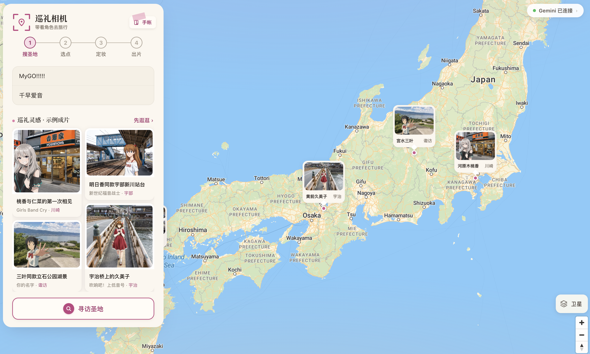

# ✨ 赛博巡礼相机 · 动漫圣地 AI 打卡神器

> 输入名字，Agent 自动搜索取景地、推理关联关系，再生成一张二次元角色亲临圣地的巡礼照。

[**👉 立即体验**](https://cyber-anime-pilgrimage.vercel.app/)

---

## 📸 这是什么？

**赛博巡礼相机** 是一个动漫圣地巡礼工具。
你只需输入角色和作品名称（可选），它就会像一名“巡礼向导”——自动联网搜索、多源推理取景地、判断地理关联性，最后调用图像模型把角色合成到实拍场景中。

**让巡礼不再受地理限制，随时开启你的二次元朝圣。**

---

## 🧭 三步完成一次巡礼

| 操作 | 说明（Agent 视角） |
|------|------------------|
| 1️⃣ **搜角色** | Agent 调用 Gemini 3.7 Flash + 谷歌搜索引擎，从 ACG 相关信源、地图信息中**推理**出最可能的现实取景地／原型地点。 |
| 2️⃣ **选地点** | Agent 将推理结果标注在地图上，并提供地名、城市、关联作品说明，由你确认最终巡礼点。 |
| 3️⃣ **生成巡礼照** | 上传你选择的二次元角色照片（全身或半身效果最佳） → Agent 根据场景光线、构图自动选择生图策略，调用 Nano Banana Pro 或 GPT-Image-2 合成角色，输出一张高融合度的巡礼照。 |

---

## 🔎 专业级圣地检索

一套面向巡礼场景的多轮检索链路：

- **多轮接地搜索**：Gemini 3.7 Flash 挂载谷歌搜索，按「联网检索 → 结构化整理」两段推进；日文／中文查询分轨（`聖地巡礼`、`舞台探訪`、`ロケ地`、`现实原型` 等），覆盖不同语区信源。
- **分级来源、优先可信**：
  - **第一优先级** —— butaitanbou.com、seichimap.jp、萌娘百科、日文维基
  - **第二优先级** —— 官方访谈与制作花絮、地方观光协会、百度百科，以及 Reddit／贴吧／X 上的实地对比攻略
- **结果可判断可信度**：每个候选都带经纬度、视觉特征与置信度分级 —— **high**（官方确认＋多源交叉验证）、**medium**（社区普遍认可、官方未明确）。

---

## 🧠 为打卡而生的 Agent

- **主动推理**：搜索不只是关键词匹配，而是理解作品与现实地点的内在关系。
- **工具自主组合**：调用搜索、地理编码、图像生成、地图展示等多类组件。
- **生成即入手帐**：生成的巡礼照即刻存进「手帐」，支持后续查阅、下载和分享。

👉 简单说：它是一个 **专做圣地巡礼的 AI Agent**。

---

## ❓ 常见问题

需要付费吗？

目前在线体验版本需要使用者自行准备相关服务商 API Key。可前往官方开通相关服务申请 Key：

- Gemini API Key → [Google AI Studio](https://aistudio.google.com/apikey)
- OpenAI API Key → [OpenAI Platform](https://platform.openai.com/api-keys)

支持哪些角色/作品？

只要作品有公认的现实取景地或原型地点，Agent 均可检索推理。覆盖面非常广，欢迎多多尝试。

生成的照片会被保存吗？

服务端不留存你的密钥、上传照片与生成结果；生成的巡礼照会存进你本地浏览器的「手帐」，方便回看、下载与分享，可随时自行删除。仅娱乐用途，请勿上传有版权争议的图片。

---

## 🧩 项目状态

- 在线体验 → [赛博巡礼相机](https://cyber-anime-pilgrimage.vercel.app/)
- 💻 推荐使用 Web 端，体验更稳定。

---

*即刻巡礼，不止于打卡。* 🚀
